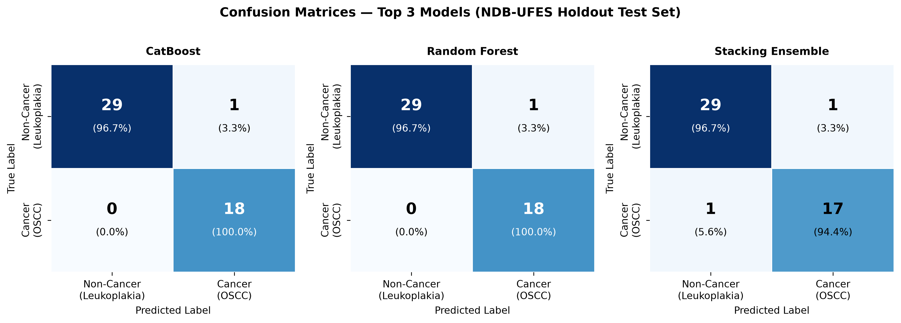
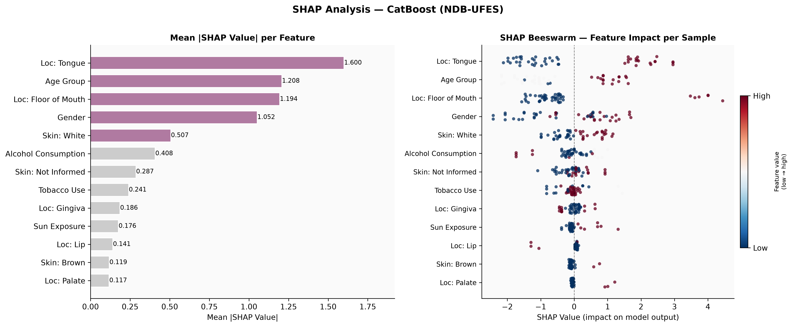

# Oral Cancer Detection Using AI

A comparative ML/DL study benchmarking **9 tabular models** (CatBoost, TabNet, XGBoost, LightGBM, Random Forest, SVM, Stacking, Logistic Regression, MLP) on real clinical data to determine which model and data modality best detects oral cancer early.
---

## What It Does

Oral Squamous Cell Carcinoma (OSCC) has an 80%+ survival rate when caught early, but under 40% when caught late — and most cases are caught late. This project tests whether AI can close that gap using two independent data sources, and which one is more deployable in low-resource clinics.

- **Tabular pipeline (complete)**: 237 real, histologically-confirmed patient records (13 clinical features — tobacco/alcohol use, age, lesion site, etc.) run through 9 models, evaluated with 5-fold cross-validation, a holdout test, and statistical significance testing.
- **Image pipeline (in progress)**: 950 verified oral lesion photographs, fine-tuned via transfer learning on 4 pretrained CNNs, with Grad-CAM for visual explainability — pending GPU execution.
- **Explainability**: SHAP values validate that model decisions align with known clinical risk factors, not just statistical noise.
- **Task**: binary classification — OSCC (cancer) vs Leukoplakia (precancerous, non-cancer).

---

## Architecture

```
Tabular Pipeline (COMPLETE)                    
─────────────────────────────                  
Raw CSV (237 patients)                          
     │                                               
     ▼                                               
Leakage-column removal                          
     │                                            
     ▼                                             
Ordinal/binary encode + mode impute             
     │                                               
     ▼                                               
One-hot encode (localization, skin color)       
     │                                          
     ▼                                               
80/20 stratified split                               
     │                                          
     ▼                                               
StandardScaler (fit on train only)                   
     │                                          
     ▼                                         
9 models × 5-fold CV + holdout eval                  
     │                                               
     ▼                                          
Statistical tests + SHAP explainability
     │                                               
Comparison 
```

---

## Tech Stack

Python 3 · pandas / numpy · scikit-learn · XGBoost · LightGBM · CatBoost · pytorch-tabnet · TensorFlow / Keras · SHAP · scipy / statsmodels · matplotlib / seaborn · Pillow · Jupyter (Google Colab + Kaggle GPU)

---

## Engineering Decisions Worth Noting

**Caught a fake dataset before it tainted the results** - the first candidate dataset (84,922 synthetic rows from Kaggle) was rejected after finding that a single column, tumor size, alone explained 96% of predictions. Replaced it with NDB-UFES, a real, peer-reviewed, histologically-confirmed 237-patient clinical dataset.

**No leakage, verified column by column** - lesion size, dysplasia severity, diagnosis-derived labels, and all patient identifiers were explicitly identified and dropped before training — leakage sources that are easy to miss and that inflate accuracy silently.

**Small-data evaluation done properly** - with only 237 samples, results rely on 5-fold stratified cross-validation (not a single train/test split) plus a fixed holdout for a second, independent check. `StandardScaler` is refit inside every fold on training data only, so no fold ever sees test statistics.

**Model claims backed by statistical tests, not just leaderboard rank** - paired t-tests and McNemar's test confirm CatBoost's lead over the next-best models is statistically significant (p < 0.05), not noise.

**Explainability tied to clinical literature** - SHAP values show tongue/lip/floor-of-mouth lesions and older age as top risk drivers, matching established OSCC epidemiology — cross-checked against Random Forest's independent feature ranking for agreement.

---

## Results (Tabular Pipeline — Complete)

5-fold CV, sorted by AUC-ROC:

| Model | AUC-ROC | Sensitivity | Specificity | MCC |
|---|---|---|---|---|
| **CatBoost** | **0.9957 ± 0.0021** | 0.9333 | 0.9522 | 0.8866 |
| Stacking Ensemble | 0.9893 ± 0.0045 | 0.9333 | 0.9251 | 0.8552 |
| Random Forest | 0.9856 ± 0.0078 | 0.9333 | 0.9522 | 0.8866 |
| TabNet | 0.9850 ± 0.0211 | 0.9339 | 0.9591 | 0.8952 |
| XGBoost | 0.9757 ± 0.0174 | 0.9228 | 0.9251 | 0.8459 |
| SVM | 0.9741 ± 0.0230 | **0.9561** | 0.9382 | 0.8922 |
| LightGBM | 0.9548 ± 0.0285 | 0.9000 | 0.9115 | 0.8109 |
| Logistic Regression | 0.9051 ± 0.0313 | 0.7702 | 0.8697 | 0.6443 |
| MLP | 0.8228 ± 0.0251 | 0.5602 | 0.9795 | 0.6239 |

**Key findings**: CatBoost wins overall (highest AUC-ROC, lowest variance, statistically significant vs. the next two models). TabNet — designed for 1000+ samples — is still competitive at n=237. SVM has the highest sensitivity, the metric that matters most for screening (fewest missed cancers). MLP underperforms across the board, and stacking doesn't beat its own best base model — small-data limits for both.

On the 48-sample holdout, CatBoost, Random Forest, and XGBoost each hit **Sensitivity = 1.0** — zero missed cancers.

---

## Visualizations

| Confusion Matrices (Top 3 Models) | SHAP Feature Impact (CatBoost) |
|---|---|
|  |  |

---

## Current Status

| Pipeline | Status |
|---|---|
| Tabular — preprocessing, 9 models, stats, SHAP | Complete |
| Image — data extraction (950 images verified) | Complete |
| Image — 4 CNN models | Pending (Kaggle GPU run) |
| Cross-modality comparison | Pending image results |
| Paper write-up | Pending |

---

## Limitations → Next Steps

| Current | Planned |
|---|---|
| Tabular-only results | Run 4 CNNs on Kaggle GPU, compare against CatBoost |
| n=237 (small clinical dataset) | Cross-modality comparison to test if images add discriminatory power |
| No visual explainability yet | Grad-CAM on best image model |
| Results section only | Write Introduction, Literature Review, Discussion, Conclusion |

---

## Reproducing This

```bash
git clone [repo-url]
cd oral-cancer-detection
pip install -r requirements.txt
jupyter notebook oral_cancer_tabular.ipynb   # full tabular pipeline, runs on CPU
```
